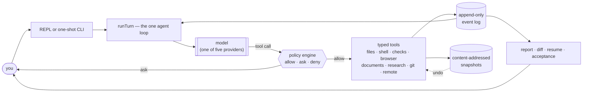

<h1 align="center">Agent CLI</h1>

<p align="center">
  <em>A local-first, terminal-native agent harness that can prove what it did.</em>
</p>

<p align="center">
  <a href="https://github.com/earthwalker17/agent-cli/actions/workflows/ci.yml"></a>
  <a href="https://github.com/earthwalker17/agent-cli/releases/latest"></a>
  <a href="LICENSE"></a>
  <a href="https://nodejs.org"></a>
  
</p>

---

Most agent tools ask you to trust a summary. Agent CLI is built so you never have to: every action
passes one policy gate, every consequence is recorded to an append-only log, and a file is only
called *verified* when a real process exited zero after that file's last change. When it cannot
prove something, it says so — in the prompt, in the report, and in this README.

It is a general-purpose harness rather than a coding assistant. The same kernel that edits code
also writes documents, researches the web, drives a browser, and publishes to GitHub — because they
all run through the same authority, evidence and recovery contracts.

## Why this exists

An agent that can run commands on your machine has to answer three questions before it is useful
for real work:

1. **What is it allowed to do, and who decided?** Not "which mode am I in" — which specific action,
   approved by whom, recorded where.
2. **What actually happened?** Not the model's account of it. The exit codes, the diffs, the
   artifacts.
3. **What if it goes wrong?** Mid-task, mid-command, mid-crash — can you get back?

Agent CLI is an attempt to answer all three structurally, in a codebase small enough to read.

## What makes it different

**One policy gate, and everything goes through it.** There is no permission "mode" to choose. Every
tool call is classified by the facts the tool declares — does it run a command, mutate files, read a
remote, send data off the machine — and the engine decides allow, ask or deny, deny-first, before
anything executes. A tool that declares conflicting facts is refused by construction. That is why
"the read tool cannot publish" is something you verify by grepping for a second fact and finding
none, rather than by reading a promise.

**Evidence, not narration.** Everything lands in an append-only JSONL log: decisions, approvals,
commands with typed termination, file mutations with before-and-after hashes, checks with their
exit codes. `agent report` is a *pure function* of that log. A file is marked `CHECKED` only when a
real process exited zero after its last mutation, scoped to the right project — a green build in
`web/` never vouches for a change in `api/`. A killed command has no exit code anywhere in the
system, so it can never read as a pass.

**Reversible by default.** In-workspace writes run without asking, but they are snapshotted first,
so `/undo` walks them back — and refuses to overwrite a file that drifted, rather than clobbering
it. Bigger jumps get hidden-ref git checkpoints that leave your branches, index and HEAD untouched.
A crash is reconciled against the log on resume: a completed edit whose completion record was lost
is recognized by its hash, not guessed at.

**Verification the model cannot fake.** The model names a *kind* — `build`, `test`, `lint`,
`typecheck` — and the harness resolves it to a command from the project's own manifest. The exit
code is the verdict; parsers may only enrich the summary. A plan task can declare gates, and its
dependents stay blocked until those gates are genuinely green.

**Bounded planning and real multi-agent boundaries.** A plan is a structured document whose approval
binds its *content hash*, so a status change does not invalidate it but a semantic edit does.
Delegated tasks are bounded child sessions with inherited-or-narrower authority; the mutating
executor role works in a disposable git worktree — never your workspace — and its changes reach you
only through a reviewed, per-file drift-refusing integration.

**Five providers, one runtime, honest degradation.** Anthropic, OpenAI, DeepSeek, Kimi and GLM
across two genuinely different protocols. A shipped capability catalog carries each model's limits,
so differences degrade honestly instead of hiding behind a false lowest common denominator: a model
without image input gets a stored-as-evidence *pointer* rather than silently dropped pixels.

**Honest limits, stated where they matter.** The OS sandbox is real, Windows-only, and does not stop
reads or network. Approved commands run unsandboxed. Command output is not scrubbed for secrets.
Each of those sentences appears in the product, not just the docs. See
[Safety](#safety-stated-plainly).

## How it works



The loop the kernel runs is **understand → plan → act → observe → verify → record → resume**, and
every arrow above is the same one for a code edit, a PDF render, a web search or a `git push`. Both
interfaces — the interactive REPL and the one-shot CLI — are thin consumers of the *same*
`runTurn`, so there is no second execution path that could behave differently.

State lives outside your workspace (`%USERPROFILE%\.agent-cli\`), and the harness refuses to start
if it would land inside. Full detail: [`docs/ARCHITECTURE.md`](docs/ARCHITECTURE.md).

## Install

Requires **Node 22+**. The CLI checks and refuses older runtimes with one actionable line.

```sh
git clone https://github.com/earthwalker17/agent-cli.git
cd agent-cli
npm install          # also builds src → dist (the `prepare` script)
npm link             # optional: puts `agent` on your PATH
```

> **Not on npm, deliberately.** The name `agent-cli` has belonged to an unrelated package since
> 2019, so this package is marked `private` and installs from a clone. `npm link` installs a binary
> called `agent`, which is a generic global name — if it collides with something you already have,
> run `node dist/cli/index.js` directly instead.

To actually run the agent you need an API key for at least one provider. Credentials are read
**only** from the environment — never from a config file, a CLI flag, or a slash command, so they
cannot end up in a log, a report, or an event:

```sh
export ANTHROPIC_API_KEY=sk-ant-...    # PowerShell: $env:ANTHROPIC_API_KEY="sk-ant-..."
```

`agent providers` lists every provider, which env var it needs, whether that var is set, and where
to get a key — without touching the network.

**Running the agent costs money** (it calls a model API). The test suite does not — it is hermetic
and needs no key.

## Quick start

```sh
mkdir my-project && cd my-project
agent
```

The first run in a folder asks for **trust** — recorded consent, not a sandbox. Then just talk:

```
agent session 20260715-101730-5d56
  workspace: C:\demo
› create a small node utility that counts words in a file
  • write_file wordstats.mjs ✓
  • run: node --test
  ⚠ approval required  [shell command — labeled observe]  run_command
  [y] allow once  [n] deny  [q] deny & stop
```

Then, when you want to know what really happened:

```sh
agent diff       # exactly what this session changed, with each file's CHECKED verdict
agent report     # the evidence record, derived purely from the event log
agent undo       # walk the last file change back
```

## Using it

You mostly just type instructions. When a decision is genuinely required, the harness asks inline —
one keystroke, at that moment. On a terminal every prompt is also an **arrow-key menu**, and the
highlight always starts on the decline row, so **Enter never grants anything**. Typing still works
exactly as before, and piped runs never see a menu.

The dozen commands worth knowing:

| | |
| --- | --- |
| `/diff` `/report [section]` `/status` | What changed, the evidence, the session state |
| `/undo [all]` `/checkpoint [list \| restore <n>]` | Walk back a change, or a whole workspace state |
| `/commit [-m "msg"]` | Commit session-attributed changes, with preview and confirmation |
| `/plan [show \| approve \| discard]` `/accept` | The plan document, and the delivery boundary |
| `@plan <request>` | Investigate read-only, write a plan, and wait for your approval |
| `@review [focus]` | A read-only inspector over the codebase — blocks nothing, costs no review round |
| `@search` / `@research <question>` | One bounded web lookup, or a delegated research subagent |
| `/help` · `/` · Tab · Ctrl+E | The command surface, its menu, completion, and expanding folded output |

`agent help` prints the full surface without starting a session, and
[`docs/USAGE.md`](docs/USAGE.md) documents every command, flag, exit code and configuration knob.

## Providers

One runtime, five providers, two protocols — plus a scripted `mock` provider that needs no network
and is how the whole loop is tested deterministically.

| Provider | Env var | Protocol | Default model |
| --- | --- | --- | --- |
| `anthropic` | `ANTHROPIC_API_KEY` | Messages API | `claude-opus-5` |
| `openai` | `OPENAI_API_KEY` | Responses API | `gpt-5.6-sol` |
| `deepseek` | `DEEPSEEK_API_KEY` | Chat Completions | `deepseek-v4-pro` |
| `kimi` | `MOONSHOT_API_KEY` · `KIMI_API_KEY` | Chat Completions | `kimi-k3` |
| `glm` | `ZAI_API_KEY` · `ZHIPU_API_KEY` | Chat Completions | `glm-5.2` |

`/provider` and `/model` switch mid-session, validate the key with a bounded probe, and record the
change as evidence — the env var *name* and the API *host*, never a credential. All five have been
exercised live through the real tool loop, on their default models; the other catalog entries are
documented, not individually live-tested. Base URLs are redirectable per provider (including the
China endpoints). See [`docs/USAGE.md`](docs/USAGE.md#providers-and-models).

## What it can do

| Capability | What that means here |
| --- | --- |
| **Code** | Ranked repository intelligence under a hard context budget, typed file tools, and typed verification across Node/TS, Python, Rust/Cargo and Go — with a missing toolchain as a first-class answer that names the exact install cure |
| **Multi-project workspaces** | Several projects, across ecosystems, discovered and kept apart: checks, previews and setups each name a project, and the harness refuses to guess when one is ambiguous |
| **Shell** | Managed execution with typed termination, real mid-command cancellation, verified tree kill, and demonstrably read-only commands auto-running inside the OS sandbox |
| **Verification** | The model names kinds, the harness names commands; managed preview servers; Playwright browser flows over the *system* browser with a typed failure taxonomy |
| **Documents and PDFs** | A spec authored as an ordinary workspace file, byte-deterministic DOCX, browser-printed PDF, parse-back validation of every artifact, and page rasterization so a vision model judges the real pages |
| **Research** | A bounded, budgeted, read-only path to the web that returns sourced claims rather than raw pages — and never counts as verification |
| **Git** | Probed repository context, an attributable session diff, deliberate session-scoped commits, and hidden-ref recovery checkpoints that leave your history untouched |
| **GitHub delivery** | Reading a remote and changing one are two separate authorities; a publish must cite a fresh observation of that exact ref, and asks every single time |
| **Memory** | Six bounded, auto-updating documents — your constitutions plus a journal, codebase summary, lessons, and perishable research notes — injected as context, never authority |

## Safety, stated plainly

Trust, approval and sandbox are three different controls, and Agent CLI keeps them separate.

- **Trust** is recorded consent that you allowed the agent into a folder. It is **not** isolation.
- **Approval** asks before anything consequential, showing the exact command, target and effect.
- **The sandbox** is the OS technically confining a process — and it is narrow and Windows-only.

On Windows, when the startup probe passes, an **auto-run** command executes at Low integrity inside
a Job Object. That genuinely denies writes to your workspace, profile, system directories and the
harness state — at the kernel — and reaps the whole process tree on kill, including a detached
grandchild. It does **not** stop reads, does **not** gate the network, and cannot hold
service-reparented work. On any other platform, or if the probe fails, there is no enforcement and
**auto-run is disabled — every command asks**. Fail closed.

**Commands you approve run unsandboxed**, at your full privileges, and their effects are not
snapshotted and not undoable. The sandbox backs the auto-run decision; it is not applied to an
approval. Undo is file-only. Command output is not scrubbed for secrets. Path checks are TOCTOU-racy
by nature. Stronger isolation — network egress control, a read/confidentiality boundary,
macOS/Linux enforcement — is honest future work.

**Read [`docs/SAFETY.md`](docs/SAFETY.md) before trusting this with anything sensitive.** It is the
complete model, including every limitation above stated in full.

## Under the hood

Lightweight is a claim about dependency surface and kernel size, not about a small line count —
so here are the real numbers, reproducible with `find src -name '*.ts' | xargs wc -l`:

| | |
| --- | --- |
| Source | **189 TypeScript files · 50,513 lines** (36,196 excluding blanks and comments) |
| Runtime kernel | **14,123 lines** — the loop, policy, event log, snapshots, exec, sandbox, providers, contracts. Everything else is a capability pack plugged into it through the same contracts |
| Runtime dependencies | **9** — and eight of them are confined to exactly one module each (`@anthropic-ai/sdk`, `undici`, `playwright-core`, `diff`, `ignore`, `fflate`, `@rgrove/parse-xml`, `unpdf`). Only `zod` is pervasive, and only as schema validation at the tool boundary |
| Frameworks | none. No web framework, no CLI framework (argv is `node:util`'s `parseArgs`), no logger, no daemon |
| Tests | **2,416 hermetic tests across 151 files** — real-OS sandbox, real-repository git, a local bare repo standing in as a real remote, real browser flows, real PDF print and rasterization |

Module boundaries are enforced by a test rather than by convention: no `../../` imports, `shared/`
is a leaf, `sandbox/` is reachable only through its index, and the set of module cycles is frozen
and removal-only.

## Documentation

| Document | What it is for |
| --- | --- |
| [`docs/USAGE.md`](docs/USAGE.md) | The complete surface: commands, flags, exit codes, providers, configuration, memory, and every capability pack in detail |
| [`docs/SAFETY.md`](docs/SAFETY.md) | The security model in full, and every honest limitation |
| [`docs/ARCHITECTURE.md`](docs/ARCHITECTURE.md) | How the system is built: modules, contracts, load-bearing orderings. Start here to understand the code |
| [`docs/ROADMAP.md`](docs/ROADMAP.md) | How it evolved, and the deferred pool — what is deliberately not built yet, and why |
| [`docs/PROJECT.md`](docs/PROJECT.md) | The long-term thesis, principles, and reference context |
| [`CHANGELOG.md`](CHANGELOG.md) | Release notes |
| [`CLAUDE.md`](CLAUDE.md) | The operating contract given to the AI agent that develops this repository. Part of the build-in-public record, not user documentation |

## Development

```sh
npm run typecheck    # tsc --noEmit, strict + noUncheckedIndexedAccess
npm test             # vitest
npm run build        # emit dist/
```

The suite is hermetic — no network, no API key, no billing — and CI gates every change on **Windows
and Linux**. Windows is the load-bearing leg: the Low-integrity sandbox suites and the win32 path
rules execute only there, so it is the run that can actually falsify this project's claims. On
Linux those suites skip (30 skipped versus 11), and the rest proves the runtime is genuinely
cross-platform.

`npm test` needs `dist/` to exist for the CLI smoke suite to run rather than skip — `npm install`
builds it for you, and CI verifies the entry point exists before testing.

Live provider smokes are opt-in and gated **twice**: they need `AGENT_LIVE_TEST=1` *and* the
relevant provider's key env var, so a missing key skips cleanly instead of failing. They are not
wired into an npm script on purpose — a test that spends money should be typed out, not inherited.

```powershell
$env:AGENT_LIVE_TEST=1; npx vitest run test/anthropic.test.ts       # Anthropic adapter + default model id
$env:AGENT_LIVE_TEST=1; npx vitest run test/live-providers.test.ts  # every provider whose key is set
```

## Contributing

Issues and pull requests are welcome, and so is criticism — the useful parts of harsh review have
historically been the most valuable input this project gets. Start with
[`CONTRIBUTING.md`](CONTRIBUTING.md): it covers the verification bar (evidence over narration), what
tends to get pushback, and which suites are platform-gated.

Security problems go through [`SECURITY.md`](SECURITY.md), privately, not the public issue tracker.

## Status

**v1.10.x — feature-complete for V1**, and an open, build-in-public engineering effort. Every
capability listed here has been exercised end to end against a real model provider on real work;
where a claim rests on hermetic tests alone, the documentation says so in the same breath.

## Licence

[MIT](LICENSE) © Eric Mono
